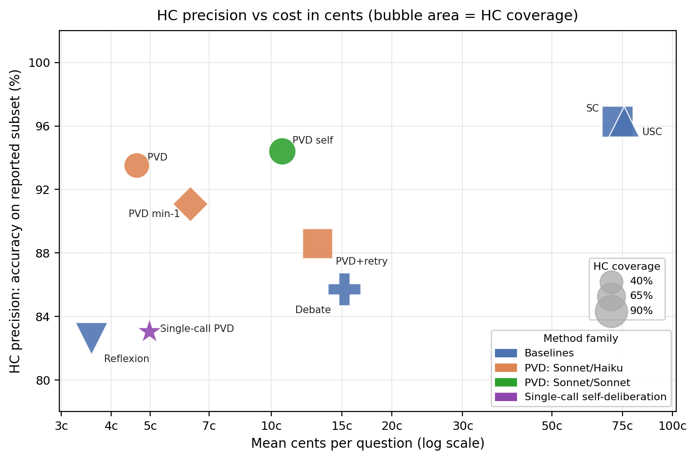

# Trust but Verify: Prover-Verifier Deliberation for Selective LLM Prediction

I hit a very practical version of the selective-prediction problem:

> Claude usage limit reached. Try again at 2:50 PM.

The cause was predictable. I had been leaning on Opus 4.7 extra-high for
coding work because Sonnet was occasionally making mistakes that felt too silly
to trust. But "always call the strongest model" is not a strategy. It is just
an expensive failure mode.

This is exactly where Prover-Verifier Deliberation fits.

The PVD coding skill treats the coding agent as a prover: it proposes a change
and states explicit claims about correctness, minimality, and test coverage. A
cheaper verifier then challenges the most fragile claim. If the code survives
with Accept + No Change, we proceed. If not, the prover revises. Only when the
loop fails or fatigues do we escalate to Opus.

The point is not to avoid strong models. The point is to call them only when
the cheaper system cannot defend its work.

In paper terms, this is selective prediction: identify the subset where the
system's output is reliable, and abstain or escalate elsewhere. In engineering
terms, it is a way to stop using frontier models as a blanket insurance policy.

**Cheap model when it can defend itself. Expensive model when it cannot.**


## Claude Code Skill

The reusable Claude Code skill lives at `skills/prover-verifier-code/`.

```bash
./skills/install.sh prover-verifier-code --global
```

It installs the skill plus two bundled subagents:

| Agent | Role |
|---|---|
| `pvd-verifier` | Sonnet, read-only challenge reviewer. |
| `pvd-opus-escalator` | Fable, write-capable escalation reviewer (the "opus" in the name is historical). |

The skill asks the prover to make claims about its own patch, then asks the
verifier to attack the weakest claim. The useful operating point is ANC:
Accept + No Change. If the verifier accepts and the prover does not need to
revise the answer or patch, the work is treated as high confidence. Otherwise
the system retries, abstains, or escalates.

## Paper Summary

The paper asks whether interactive proof structure can be used as a practical
calibration mechanism for frozen LLMs. Rather than trying to make model
internals transparent, PVD tries to make the output verifiable through
interaction.

The central idea is deliberation: a prover gives an answer, decomposes its
reasoning into checkable sub-claims, and defends those claims under targeted
challenge. A verifier repeatedly returns one of three verdicts:

| Verdict | Meaning |
|---|---|
| `Accept` | The verifier accepts the current answer and reasoning. |
| `Challenge` | The verifier targets the weakest sub-claim and asks for a defense. |
| `Reject` | The verifier finds a flaw or the attempt reaches the fatigue limit. |

The protocol is deliberately simple:

1. The prover answers the question and lists atomic sub-claims.
2. The verifier inspects the proof sketch and either accepts, rejects, or
   challenges the weakest sub-claim.
3. The prover responds to that specific challenge and may revise its answer.
4. The loop stops on Accept, Reject, or a fatigue limit; retry variants start a
   fresh attempt with the previous failure as context.

PVD is inspired by interactive proof systems, but frozen LLMs do not inherit
classical soundness or completeness guarantees. The paper therefore treats the
verdict empirically as a selective-prediction signal.

| Classical interactive proof | PVD in this paper |
|---|---|
| Prover | Answering LLM. |
| Verifier | Challenging LLM. |
| Statement | Multiple-choice question plus candidate answer. |
| Proof transcript | Sub-claims plus challenge-response dialogue. |
| Round limit | Fatigue limit before forced rejection or retry. |
| Completeness proxy | Precision on the accepted high-confidence subset. |
| Soundness proxy | Accuracy gap between accepted and non-accepted subsets. |

The high-confidence signal is ANC: the verifier accepts and the prover's
answer never changes. ANC is useful because it is stronger than sample
agreement. The model must not only repeat an answer; it must defend the
reasoning under adversarial pressure without revising.

The practical implications mirror the older interactive-proof motivation:

- Verifiability can come from interaction rather than transparency into model
  weights or hidden chains of thought.
- More inference compute is useful only when it produces a better abstain or
  escalation decision, not merely a longer answer.
- The verifier's competence is measurable: when the ANC gap collapses or
  inverts, the verifier is outside its effective region.

## Topline Results

All GPQA rows use GPQA Diamond. HC means "high confidence": ANC for PVD,
full consensus for SC/USC, agent consensus for Debate, and stable unchanged
answers for Reflexion. Gap is HC precision minus accuracy on the complement.



### GPQA Diamond

| Prover | Method | Verifier | HC signal | Acc | HC cov | HC prec | Gap | Calls |
|---|---|---|---|---:|---:|---:|---:|---:|
| Sonnet 4.6 | Single-call PVD | Self | ANC | 78.8% | 63% | 83.9% | +13.6 | 1 |
| Sonnet 4.6 | SC (k=8) | - | Full consensus | 83.3% | 72% | 91.5% | +29.0 | 8 |
| Sonnet 4.6 | USC (k=8) | Sonnet 4.6 | Full consensus | 81.8% | 72% | 91.5% | +29.0 | 9 |
| Sonnet 4.6 | Debate (3x2) | Sonnet 4.6 | Agent consensus | 83.3% | 95% | 85.7% | +52.4* | 9 |
| Sonnet 4.6 | Reflexion | - | Stable, unchanged | 82.3% | 93% | 82.6% | +4.0* | <=5 |
| Sonnet 4.6 | PVD | Haiku 4.5 | ANC | 76.8% | 77% | 84.2% | +32.0 | ~3 |
| Sonnet 4.6 | PVD dagger | Haiku 4.5 | ANC | 79.8% | 65% | 89.9% | +29.1 | ~6 |
| GPT-5.4 | Direct | - | - | 72.7% | - | - | - | 1 |
| GPT-5.4 | SC* (k=8) | - | Full consensus | 94.9% | 90% | 97.2% | +23.5* | 8 |
| GPT-5.4 | PVD | GPT-5.4-mini | ANC | 77.8% | 43% | 97.6% | +34.8 | ~3 |
| Gemini 3.1 Pro | SC* (k=8) | - | Full consensus | 93.9% | 94% | 97.3% | +60.9* | 8 |
| Gemini 3.1 Pro | PVD | Flash-Lite | ANC | 94.4% | 57% | 97.3% | +6.6 | ~4 |
| Gemini 3.1 Pro | PVD+retry | GPT-5.5-pro | ANC | 92.9% | 75% | 97.3% | +17.3 | ~29 |

`Single-call PVD` is a one-call self-deliberation ablation, not a plain direct
CoT run. `PVD dagger` uses a challenge-first verifier prompt. `SC*` denotes extended
thinking SC from an external benchmark, so it is not directly cost-comparable
to the standard API PVD runs. `*` means the high-confidence set covers more
than 90% of questions, leaving fewer than 20 complement examples, so the gap
estimate is unstable.

### GPQA Domain Breakdown

| Domain | n | Sonnet+Haiku dagger ANC / prec / gap | GPT-5.4+mini ANC / prec / gap | Gemini+Flash-Lite ANC / prec / gap |
|---|---:|---:|---:|---:|
| Chemistry | 93 | 49% / 80% / +25.1 | 16% / 100% / +46.2 | 45% / 100% / +7.8 |
| Physics | 86 | 83% / 96% / +15.8 | 70% / 98% / +9.9 | 66% / 100% / +6.9 |
| Biology | 19 | 63% / 92% / +34.5 | 53% / 90% / +23.3 | 68% / 77% / +10.3 |

### Humanity's Last Exam

The main HLE run uses GPT-5.5 as prover and Gemini 3.1 Pro as verifier over
all 513 HLE questions.

| Domain | n | Overall acc | ANC | ANC prec | Non-ANC acc | Gap |
|---|---:|---:|---:|---:|---:|---:|
| Biology / Medicine | 147 | 41% | 46% | 50.0% | 32.9% | +17.1 |
| Math | 89 | 61% | 67% | 76.7% | 27.6% | +49.1 |
| Humanities / Soc. Sci. | 79 | 51% | 53% | 61.9% | 37.8% | +24.1 |
| Computer Science / AI | 66 | 52% | 53% | 68.6% | 32.3% | +36.3 |
| Other | 44 | 32% | 39% | 52.9% | 18.5% | +34.4 |
| Physics | 37 | 27% | 57% | 33.3% | 18.8% | +14.6 |
| Chemistry | 26 | 46% | 35% | 77.8% | 29.4% | +48.4 |
| Engineering | 25 | 40% | 64% | 31.2% | 55.6% | -24.3 |
| All | 513 | 45.6% | 52% | 59.0% | 31.0% | +27.9 |

HLE shows both the promise and the failure mode. Stronger model pairings can
recover a positive ANC gap, but weak verifier pairings can collapse or invert
the signal.

| Prover | Verifier | Acc | ANC | ANC prec | Gap |
|---|---|---:|---:|---:|---:|
| Sonnet 4.6 | Haiku 4.5 | 20.1% | 31% | 15.2% | -7.1 |
| Opus 4.6 | Sonnet 4.6 | 40.0% | 67% | 41.4% | +4.3 |
| GPT-5.5 | Gemini 3.1 Pro | 45.6% | 52% | 59.0% | +27.9 |

### Verifier Choice

Holding the prover fixed shows that verifier strictness and independence drive
calibration.

| Prover | Verifier | ANC | ANC prec | Non-ANC acc | Gap | Avg rounds |
|---|---|---:|---:|---:|---:|---:|
| Sonnet 4.6 | Self | 63% | 83.9% | 70.3% | +13.6 | 2.1 |
| Sonnet 4.6 | Haiku | 77% | 84.2% | 52.2% | +32.0 | 1.7 |
| Sonnet 4.6 | Haiku dagger | 65% | 89.9% | 60.9% | +29.1 | 3.0 |
| Gemini 3.1 Pro | Flash-Lite | 57% | 97.3% | 90.7% | +6.6 | 1.9 |
| Gemini 3.1 Pro | GPT-5.5-pro | 75% | 97.3% | 80.0% | +17.3 | 14.3 |

### PVD and Self-Consistency Select Different Questions

SC full consensus and PVD ANC overlap substantially, but each catches errors
that the other misses.

| Subset | n | Share | SC acc | PVD acc |
|---|---:|---:|---:|---:|
| Both HC | 107 | 54% | 96.3% | 96.3% |
| SC only | 35 | 18% | 77.1% | 62.9% |
| PVD only | 22 | 11% | 72.7% | 59.1% |
| Neither | 34 | 17% | 55.9% | 58.8% |

### Clean RTTR Runs With Confidence Intervals

The clean RTTR reruns use the `rttr-v1` schema with full transcripts,
per-call token accounting, measured costs, and 95% confidence intervals.
The `Gap p` column is a two-sided Fisher's exact test of the null hypothesis
that the HC and non-HC subsets are equally accurate.

| Run | Acc | HC cov | HC prec | Gap bootstrap CI | Gap p |
|---|---:|---:|---:|---:|---:|
| `pvd_standard` | 74.2 [67.7, 79.8] | 54.5 [47.6, 61.3] | 93.5 [87.2, 96.8] | +42.4 [+31.0, +53.5] | <0.001 |
| `pvd_min1` | 76.3 [69.9, 81.7] | 51.0 [44.1, 57.9] | 91.1 [83.9, 95.2] | +30.3 [+18.9, +41.5] | <0.001 |
| `pvd_self` | 80.3 [74.2, 85.2] | 63.1 [56.2, 69.5] | 94.4 [88.9, 97.3] | +38.2 [+26.0, +50.4] | <0.001 |
| `pvd_retry` | 79.8 [73.7, 84.8] | 79.8 [73.7, 84.8] | 88.6 [82.7, 92.7] | +43.6 [+27.2, +60.0] | <0.001 |
| `debate` | 83.3 [77.5, 87.9] | 95.5 [91.6, 97.6] | 85.7 [80.0, 90.0] | +52.4 [+17.4, +85.6] | <0.001 |
| `reflexion` | 82.3 [76.4, 87.0] | 92.9 [88.5, 95.7] | 82.6 [76.5, 87.4] | +4.0 [-17.7, +29.1] | 0.717 |
| `sc_epoch` | 87.4 [82.0, 91.3] | 81.3 [75.3, 86.1] | 96.3 [92.1, 98.3] | +47.6 [+30.9, +64.1] | <0.001 |
| `usc` | 85.4 [79.8, 89.6] | 81.3 [75.3, 86.1] | 96.3 [92.1, 98.3] | +58.4 [+42.2, +74.1] | <0.001 |
| `single_call` | 75.8 [69.3, 81.2] | 59.6 [52.6, 66.2] | 83.1 [75.3, 88.8] | +18.1 [+5.7, +30.7] | 0.004 |

Reflexion's gap CI brackets zero and its gap is not significant (p = 0.72);
every other run has p < 0.05. In these runs, stability across two independent
samples is much weaker than PVD's argument-defensibility signal.

## Repository Layout

| Path | Purpose |
|---|---|
| `rttr/` | Config-driven RTTR evaluation package. |
| `configs/` | YAML run configs for PVD, Debate, Reflexion, USC, and single-call runs. |
| `prompts/` | Prompt templates loaded by `rttr/`. |
| `data/` | RTTR-v1 run outputs used for analysis and statistics. |
| `data/paper/` | Legacy-format raw results required by the table-generation scripts. |
| `tables/` | Table builders and generated LaTeX tables. |
| `figures/` | Figure generator and `fig_rttr_cost.png` (cost–precision frontier). |
| `skills/` | Claude Code PVD skill and bundled verifier/escalator subagents. |
| `tests/` | Unit tests for the statistics helpers (`test_stats.py`), the summary token/cost accounting (`test_build_summary.py`), and the CI table formatting (`test_table9_rttr_stats.py`). |
| `run_all_rttr.sh` | Convenience wrapper that runs the six clean RTTR configs and saves logs. |
| `run_pvd.ipynb` | Interactive notebook for a single-question PVD transcript and small GPQA batch. |

The LaTeX paper source is kept in a separate repository; this repository
contains the code, prompts, data, and the reproducible table/figure
pipeline. Current experiments live in the config-driven `rttr/` package.

## Build

Run from the repository root. The project has been tested with the local
`trust-but-verify` Conda environment.

```bash
PYTHONPATH="$PWD" python -m rttr.summary
PYTHONPATH="$PWD" python -m rttr.stats --output tables/generated/rttr_stats.json
PYTHONPATH="$PWD" python tables/make_all_tables.py
PYTHONPATH="$PWD" python figures/make_all_figures.py
```

This regenerates the analysis artifacts consumed by the paper:

- `tables/generated/tab_gpqa_main.tex`
- `tables/generated/tab_gpqa_domain.tex`
- `tables/generated/tab_hle.tex`
- `tables/generated/tab_verifier.tex`
- `tables/generated/tab_hle_capability.tex`
- `tables/generated/tab_sc_pvd.tex`
- `tables/generated/tab_rttr_stats.tex`
- `figures/fig_rttr_cost.png`

## Running RTTR Experiments

Run a configured experiment with:

```bash
PYTHONPATH="$PWD" python -m rttr.run --config configs/pvd_standard.yaml
```

Useful variants:

```bash
PYTHONPATH="$PWD" python -m rttr.run --config configs/pvd_standard.yaml --n 10 --output-suffix _pilot
PYTHONPATH="$PWD" python -m rttr.report
PYTHONPATH="$PWD" python -m rttr.stats --pairs
```

Two convenience helpers are also tracked:

- `run_all_rttr.sh` runs the clean RTTR suite in sequence:
  `reflexion`, `pvd_standard`, `pvd_min1`, `pvd_self`, `pvd_retry`, and
  `debate`. It writes per-run logs to `logs/rttr_<name>.log` and result JSONs
  under `data/`. This makes live API calls and can overwrite existing outputs.
- `run_pvd.ipynb` is an interactive notebook for quickly inspecting one PVD
  deliberation transcript and running a small GPQA Diamond batch. The notebook
  defaults to Sonnet 4.6 as prover, Haiku 4.5 as verifier, and writes its
  batch output to `data/gpqa_results_pvd_notebook.json`.

Each RTTR output is a JSON list in `data/` with a leading `_meta` record,
`schema_version: "rttr-v1"`, per-call token accounting, costs, transcripts,
and protocol-specific high-confidence signals.

The paper currently combines two data sources:

- `data/gpqa_results_*.json`: RTTR-v1 outputs from the clean reruns.
- `data/paper/*.json`: legacy-format result files still used by the current
  table builders for HLE rows, domain breakdowns, and older cross-model rows.

Keeping the legacy-format files under `data/paper/` makes the dependency
explicit without keeping the old root-level evaluation harnesses.

## External Log Provenance

Root-level `.eval` files are ignored by git because they are external Inspect
AI log artifacts. The local file
`epoch_ai_sonnet_4_6_gpqa_diamond_58eQmyCfPa3FufhXJFvAL2.eval` is the Epoch AI
Sonnet 4.6 GPQA Diamond log from:

```text
https://logs.epoch.ai/inspect_ai_logs/58eQmyCfPa3FufhXJFvAL2.eval
```

Gemini-3.1-pro GPQA Diamond log from:
```text
https://logs.epoch.ai/inspect_ai_logs/kR9F3oHBCnwQW4AiTPKwpd.eval
```

gpt-5.4-2026-03-05 GPQA Diamond log from:
```text
https://logs.epoch.ai/inspect_ai_logs/fFatyce8UvpN7ZivdmrhAy.eval
```

The generated paper tables use parsed JSON summaries rather than committing the
raw `.eval` log.
